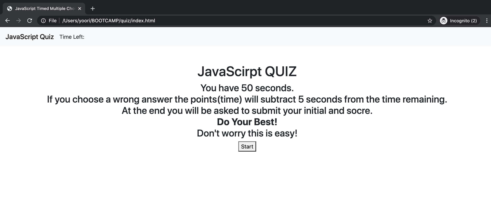

# javaScirpt Quiz

### Abstract

This quiz application is simple multiple quiz page. The quiz has a time limit 50 seconds (Timer will start when quizzes are present. When the timer reaches 0, it will give a promt for restart the quiz. and when all questions are answered the page will ask an username to store with score at local storage.

### Screen Shot

### Installation
To take this quiz you can click : [here](https://samuelyoo.github.io/javascript-quiz)

### Usage
When user click the start button, then the quiz will begin and timeer will be start. 
please click a setenece or a word to choose your answers, and it will show a next question.
(If you choose wrong answer it will subtract 5 seoncs from total time remain.)
(also when timer hit 0 you have to restart your quiz.)
When you finish quiz enter your name or initial to submit a score and name.

#### Contact
Email: sam.hc.yoo@gmail.com

LinkedIn: [LinkedIn](https://www.linkedin.com/in/samuel-hc-yoo)

#### Tool
bootstrap were used for the navbar

#### Licence
MIT license
copyright (c) Samuel Yoo
